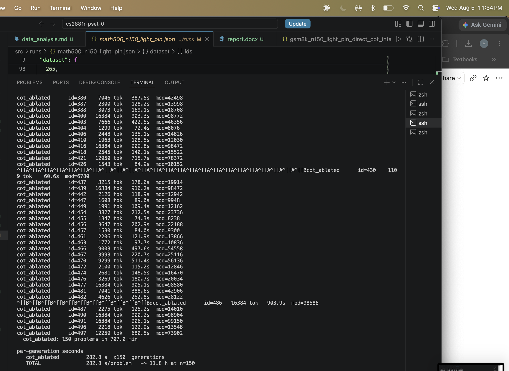

# CS 2881R Homework Zero

**Does removing the workspace hurt *internal* reasoning more than *externalised* reasoning?**

[Assignment](https://boazbk.github.io/mltheoryseminar/hw0-2026/), on
[*Verbalizable Representations Form a Global Workspace in Language Models*](https://transformer-circuits.pub/2026/workspace/index.html)
(Anthropic, 2026). The write-up is [`report.pdf`](report.pdf) in this directory.

The paper's claim is that a small, selective set of verbalizable representations — the
**J-space** — acts as a global workspace that flexible internal reasoning is routed
through. If that is true, ablating it should cost the model most where it has to hold
reasoning *inside* the residual stream, and least where the reasoning has been written
out onto the page as chain-of-thought tokens.

That is the one number this repo is built to measure:

```
interaction = (direct_intact - direct_ablated) - (cot_intact - cot_ablated)
```

positive if ablation hurts direct answering more than it hurts CoT. Plus the paper's own
control — the same arithmetic with **ten random unembedding directions** substituted for
the ten J-lens directions — which must come out at ~0, or what we measured is broad
degradation rather than a J-space effect.

Model: **Qwen3-4B** (36 layers), greedy, checkpoint pinned by Hub commit.
Datasets: **GSM8K**, **MATH-500**, **AIME 2024**.

---

## Design

Six cells, `{level} x {state}`, built from a grid in `scoring.py` so a condition name can
never be hand-typed and drift:

|            | intact | ablated (top-10 J-lens) | random (10 random unembedding rows) |
|------------|--------|-------------------------|-------------------------------------|
| **cot**    | ✓      | ✓                       | ✓                                   |
| **direct** | ✓      | ✓                       | ✓                                   |

* **cot** — normal thinking mode, reasoning externalised onto the page.
* **direct** — `\boxed{` prefill plus "respond with only the final answer", so the answer
  token is computed internally. This is the arm the hypothesis predicts should break.
* **ablated** — at every generation position and every layer in the band, zero the
  residual-stream projection onto each of the top-`k=10` J-lens directions, *exempting*
  the J-lens vectors of the tokens in the top-10 of a paired **clean** forward pass, as
  the paper prescribes. Under the feasibility approximation `J = I` the J-lens vector for
  token `t` is a row of the unembedding, gain-scaled.
* **random** — the same operation on ten directions drawn uniformly from all 151,936
  unembedding rows. The matched control for "does it matter *which* directions we remove".

Two contrasts are reported per dataset:

* **selectivity** `= (intact - ablated) - (intact - random) = random - ablated`, within an arm.
* **interaction**, above, across arms — with the random-control interaction printed beside it.

Ablation **strength is band width**, not `k` and not magnitude. The primary band is the
paper's coherence-preserving anchor L38–54 on its reindexed 0–100 scale, converted to
Qwen3-4B's 36 layers by `hooks.band_from_depth` → **layers 14–19** (`light`). `heavy`
(0.38–0.92) and an interpolated `medium` exist in `config.BANDS` but were not run.

Everything above is fixed in [`src/config.py`](src/config.py) **before** ablated data is
seen — sample sizes (from `power.py`), token caps, the band, `k`, the projection mode, the
exclusion rule, the degeneration gate — and every accessor *raises* on an undecided value
rather than defaulting. That file is the pre-registration, executable; its comments carry
the measurement or the argument behind each number, including the ones we got wrong first.

---

## Prompts

Every prompt in this experiment is built by **one function**,
`scoring.render_prompt` — generation, the probes and the manifest fingerprint all call it,
so a prompt cannot drift from the hash that claims to describe it:

```python
tokenizer.apply_chat_template(
    [{"role": "user", "content": question + suffix}],
    tokenize=False, add_generation_prompt=True,
    enable_thinking=thinking,
) + prefill
```

A condition is therefore fully specified by `(thinking, suffix, prefill)`, which
`run.conditions()` builds from the grid. The `suffix` and `prefill` live in
[`src/config.py`](src/config.py) (`DIRECT_INSTRUCTION`, `DIRECT_PREFILL`) — never in the run
script, and never copied into a probe.

### The CoT condition — `cot_intact`, `cot_ablated`, `cot_random`

`thinking=True`, no suffix, no prefill. The question goes in unmodified and Qwen3 opens its
own `<think>` block:

```
<|im_start|>user
<QUESTION><|im_end|>
<|im_start|>assistant
```

Identical for all three datasets.

### The direct condition — `direct_intact`, `direct_ablated`, `direct_random`

`thinking=False` (which makes the template emit an **empty** `<think></think>` block, so the
model cannot reason in it) plus a per-dataset instruction suffix and the shared prefill
`\boxed{`. Generation starts *inside* the box, so the first generated token is the answer:

```
<|im_start|>user
<QUESTION>

Respond with only the final numeric answer and nothing else. Do not show any reasoning.<|im_end|>
<|im_start|>assistant
<think>

</think>

\boxed{
```

The prefill is the mechanism, not the instruction: asking a 4B model not to reason is
instruction-following, and compliance degrades as problems get harder — the *same axis* as
the research question, so leakage would be inseparable from a real difficulty effect.
Prefilling is mechanical, so it does not vary with difficulty.

The three instruction suffixes, verbatim from `config.DIRECT_INSTRUCTION`:

| dataset | suffix (after `\n\n`) | why |
|---|---|---|
| `gsm8k` | `Respond with only the final numeric answer and nothing else. Do not show any reasoning.` | byte-for-byte what the pilot and the committed n=150 run used; the archived manifest and `probes/capture.py` both pin this exact string |
| `math500` | `Respond with only the final answer and nothing else. Do not show any reasoning.` | GSM8K's string **minus "numeric"**, and nothing else. MATH-500 golds are frequently non-numeric (`\frac{3}{2}`, `2\sqrt{2}`, intervals), so "numeric" would instruct the model away from the format its own gold uses — inflating `unparsed` preferentially in the degraded cells, i.e. straight into the interaction |
| `aime24` | `Respond with only the final numeric answer and nothing else. Do not show any reasoning.` | GSM8K's string verbatim; AIME answers really are integers 0–999, so the wording is correct as written and the byte-identical string keeps the two direct cells as close to one condition as two datasets allow |

### Prompt fingerprints

`scoring.prompt_fingerprint` hashes the exact rendered template for the canonical question
`PROBE`, prefill included, and the value is written into every run's manifest. Two runs
whose fingerprints differ had different prompts, full stop. Regenerate them with the
tokenizer alone — no weights, no GPU:

```bash
python -c "
from transformers import AutoTokenizer
import config, scoring, loaders
tok = AutoTokenizer.from_pretrained(loaders.MODEL, revision=loaders.MODEL_REVISION)
print('cot          ', scoring.prompt_fingerprint(tok, True))
for d in ('gsm8k', 'math500', 'aime24'):
    print(f'{d:<13}', scoring.prompt_fingerprint(tok, False, *config.direct_prompt(d)))
"
```

| condition | fingerprint |
|---|---|
| `cot` (all datasets) | `7e77fde99496bf55` |
| `direct`, `gsm8k` | `683d8ea5f9e42c80` |
| `direct`, `math500` | `19fabd7b4c44e85f` |
| `direct`, `aime24` | `683d8ea5f9e42c80` (identical to GSM8K by design) |

`probes/capture.py` asserts `683d8ea5f9e42c80` against the archived GSM8K manifest, so a
one-word edit to the instruction turns that probe red rather than silently letting it
describe a condition that never ran.

### Worked example: one problem end to end

GSM8K problem id 1167, gold `120` — both arms get it right. Every `raw` field below is
copied out of `runs/final/gsm8k_n150_light.jsonl`.

> Jack had \$100. Sophia gave him 1/5 of her \$100. How many dollars does Jack have now?

`direct_intact` — the prompt is the template above with that question substituted; the model
generates 5 tokens, starting inside the box:

```
\boxed{120}<|im_end|>
```

`cot_intact` — same question, no suffix, no prefill; 502 tokens, opening its own `<think>`:

```
<think>
Okay, let's see. Jack starts with $100. Then Sophia gives him 1/5 of her $100. Hmm, so
first, I need to figure out what 1/5 of Sophia's $100 is.
...
</think>
... Adding this amount to Jack's original money:
$$ 100 + 20 = 120 $$
**Answer:** Jack now has $\boxed{120}$ dollars.<|im_end|>
```

Only the text *after* `</think>` is scored (`scoring.strip_think`). That is mandatory, not
cosmetic: reasoning traces contain abandoned `\boxed{}` candidates and `math-verify`
prioritises boxed matches, so without it a trace reading
`\boxed{72}. No wait.</think> The answer is 144.` scores **correct against gold 72**.
Generation is also truncated at `<|im_end|>`, not merely stripped of it — the model
sometimes runs past EOS and hallucinates a second turn, which is an ablation-degraded
behaviour, so grading it would have handed a false positive preferentially to the ablated
cells.

To pull any other example yourself:

```bash
python -c "
import json
for l in open('runs/final/gsm8k_n150_light.jsonl'):
    r = json.loads(l)
    if r['id'] == 1167 and r['cond'] == 'cot_ablated':
        print(r['raw'])
"
```

### Prompts used by the probes and controls

*To fill in: the SST-2 and MMLU prompts used by the damage-floor probe — the automatic-task
control that asks whether the model is ablated or merely broken. They currently live only in
`probes/damage_floor.py`, and both are single-token-answer by construction so that a top-1
flip at the last prefill position **is** the accuracy effect, the same measurement the direct
condition makes.*

---

## Experimental settings

Every number below is fixed in [`src/config.py`](src/config.py) before ablated data is seen,
and is re-read from there at run time — this table is a convenience, not a second source of
truth. The reasoning for each (including the choices we made wrongly first and reversed)
sits in the comment next to it.

**Model and decoding** — `loaders.py`

| setting | value |
|---|---|
| checkpoint | `Qwen/Qwen3-4B` at Hub commit `1cfa9a7208912126459214e8b04321603b3df60c` |
| dtype / placement | `bfloat16`, single device, no `device_map`, no sharding, no quantization |
| decoding | greedy — `do_sample=False`, `temperature`/`top_p`/`top_k` set to `None` at load time |
| layers | 36 |

**Intervention** — `config.py`, applied by `hooks.make_ablation`

| setting | value |
|---|---|
| band (`PRIMARY_BAND`) | `light` = depths 0.38–0.54 → **layers 14–19** (paper's L38–54) |
| unused bands | `medium` 0.38–0.73 (interpolated by us), `heavy` 0.38–0.92 |
| `K_ABLATE` | 10 J-lens directions zeroed per position |
| `EXCLUDE_TOPK` | 10 — clean-pass top-10 tokens exempted (`USE_EXCLUSION=True`) |
| `PROJECTION_MODE` | `"each"` (project out each direction in turn, the paper's literal wording) |
| `PROJECT_GAIN_SCALED` | `True` — remove `W_U[t] * g`, not bare `W_U[t]` (a stated deviation) |
| random control | 10 rows drawn uniformly from all 151,936 unembedding rows, no exclusion |
| `K_OCCUPANCY` | 25 — sparse-decomposition occupancy only, **not** used for ablation |

**Sample and generation, per dataset** — `config.N_DEFAULT`, `RUN_SAMPLE`, `CAPS`

| dataset | source (split, rows) | n | how drawn | CoT cap | direct cap |
|---|---|---|---|---|---|
| GSM8K | `openai/gsm8k` `main`, `test`, 1319 | 150 | uniform, seeded shuffle prefix | 3072 | 128 |
| MATH-500 | `HuggingFaceH4/MATH-500`, `test`, 500 | 150 | stratified, 30 per difficulty level | 16384 | 128 |
| AIME 2024 | `HuggingFaceH4/aime_2024`, `train`, 30 | 30 | the whole dataset | 32768 | 512 |

`SEED = 0` everywhere. `config.problem_ids` is a shuffle **prefix**, so samples nest by
construction across n and across datasets — which is what makes a pilot, a timing run and
the full run comparable at all, and what lets `run.pin_guard` accept an n-extension.

**Calibration, stopping rule and gate** — `config.py`

| setting | value |
|---|---|
| `MEASURE_CAP` (calibration ceiling, not a cap) | `cot` 40960 (the checkpoint's `max_position_embeddings`), `nothink` 2048, `direct` 512 |
| `CEILING_RETRY_MAX_HIT` | 0.15 — above this, **do not raise the ceiling again**; the finding is that the model does not terminate |
| `CAP_HEADROOM` / `CAP_ROUNDING` | 1.5× the p99, rounded up to a multiple of 128 |
| `CALIB_SAMPLE` | MATH-500: 20 level-5 problems from outside the run sample + 5 level-3 monotonicity contrasts. AIME: problems 11–15 of each exam (10), no holdout possible |
| `LOOP_GATE` | signal `unusable` (`incomplete`/`unparsed`/`error`), mode `delta` vs the matched intact cell, threshold `0.15`, first `20` problems of `cot_ablated`. Exit code 3 = fired |

**Analysis** — `analysis.py`

| setting | value |
|---|---|
| CIs | 10,000-resample paired percentile bootstrap over problems, `seed=0` (so intervals are reproducible to the digit) |
| per-cell tests | McNemar, exact binomial on discordant pairs |
| `RUN_LEVELS` | `("cot", "direct")` — `nothink` is defined in the grid but never generated |

**Environment** — `requirements.txt`, exact pins

Python 3.12; `torch==2.13.0` (platform wheel deliberately unpinned — see
[Setup](#setup)), `transformers==5.14.1`, `accelerate==1.14.0`, `datasets==5.0.1`,
`math-verify==0.9.0`, `latex2sympy2_extended==1.11.0`, `sympy==1.14.0`, `numpy==2.5.1`.
Two of those pins are load-bearing rather than tidy: every contract in `hooks.py` is
specific to transformers 5.14.1, and `math-verify`'s own defaults are length-biased, so
`scoring.py` overrides them against this exact version's behaviour.

---

## Results so far

Full transcripts: [`src/data_analysis.md`](src/data_analysis.md). Figures:
[`figures/`](figures/). Raw generations: [`src/runs/final/`](src/runs/final/) — the
canonical merged run files every number below is computed from.

| dataset | n | CoT intact / ablated / random | Direct intact / ablated / random | selectivity (CoT arm) | interaction (ablation) | interaction (random control) |
|---|---|---|---|---|---|---|
| GSM8K | 150 | 80.7 / 74.7 / 76.7 | 27.3 / 24.7 / 24.7 | +2.0 [−3.3, +7.3] | **−3.3 [−10.7, +4.0]** | −1.3 [−7.3, +4.7] |
| MATH-500 | 150 (level-balanced) | 94.0 / — / 96.0 | 34.0 / 30.7 / 28.7 | — | *regenerating, see below* | **+7.3 [+2.7, +12.7]**, p=0.003 |
| AIME 2024 | 30 | 66.7 / 55.0 (n=20) / 73.3 | 0.0 / 0.0 / 0.0 | +20.0 [0.0, +40.0] | −20.0 [−40.0, +0.0] | 0.0 [−15.0, +15.0] |

Accuracies in %, contrasts in percentage points with 95% paired-bootstrap CIs.

**Read this before reading the table.**

* **GSM8K is the one complete, clean result, and it is a null.** No selectivity in either
  arm, and the interaction points the *wrong way* (ablation cost CoT slightly more than
  direct) with a CI spanning zero. The random control is also ~0, so this is a null rather
  than a mess.
* **MATH-500's `cot_ablated` cell was generated and then lost.** All 150 problems ran to
  completion. I then managed to stupidly lose the data from the runs. The cell is
  being regenerated, and the records plus the updated analysis, table row and figures
  **will be in this repo by noon on Thursday 6 August 2026**. Until then MATH-500 stands at
  5 of 6 cells and has no ablation interaction.

  <details>
  <summary>Proof the run completed (terminal log, 2026-08-05 23:34)</summary>

  <br>

  

  </details>

* **MATH-500's random-control interaction is significantly non-zero** — the quantity that
  is supposed to be ~0 is not — which on its own says the direct arm degrades under *any*
  ten removed directions on this dataset. The regenerated ablation interaction cannot be
  read without that beside it, and must not be read against zero.
* **AIME 2024's `cot_ablated` cell is 20 of 30 problems because the pre-registered
  degeneration gate fired and stopped it**: 40% unusable against `cot_intact`'s 5%, a
  +35pt delta against a 15% threshold, with 8 cap hits at 32768 and 6 of those ending in
  verbatim repetition loops. The +20 selectivity and the −20 interaction are computed over
  that stopped cell, at n=20, with 40-point CIs. They are not evidence of anything yet.
  Everything reported here keeps the cell at 20/30: `src/shard_ablated_tail.sh` spells out
  what completing it would take — blinding the gate that stopped it — and why that would
  oblige disclosing that the pre-registered protocol for the cell had been overridden.
* **AIME direct accuracy is 0% in all three states.** A floor cannot move, so that arm
  contributes no information about ablation on this dataset.

See [Disclosures](#disclosures) for the rest.

---

## Repository layout

```
report.pdf                the write-up — the deliverable
report.docx               its source document, generated by make_report.js (not hand-edited)
make_report.js            builds report.docx (Node + the `docx` package)
CLOUD.md                  renting a GPU: install, cache, verify-before-you-pay, device rules
figures/                  fig1_accuracy.png, fig2_contrasts.png, and the lost-run log screenshot
requirements.txt          exact pins; two of them are load-bearing, see the comments
src/
  config.py               THE PRE-REGISTRATION. Every fixed number, with its reasoning.
  hooks.py                capture + intervention. Encodes 5 transformers-5.14.1 contracts.
  loaders.py              model loading in one place; pinned revision; device resolution
  run.py                  generation — the six cells. Resumable, shardable, gated.
  scoring.py              answer extraction + scoring, one path for all three datasets
  analysis.py             paired bootstrap, McNemar, the interaction
  analyze.py              scoring + reporting over a generations file (no GPU)
  power.py                how many problems per cell — run BEFORE spending GPU hours
  merge_runs.py           merge staged per-pod files into one file, refusing mismatches
  make_figures.py         the two report figures
  shard_ablated_tail.sh   code to complete aime24's stopped cell across two cards
  verify_shard_plan.py    GPU-free pre-flight proving what that script does before renting
  data_analysis.md        analyze.py transcripts the figures and the report are read off
  probes/                 run-once diagnostics; each one's conclusion is frozen into config.py
  tests/                  186 tests, no weights, no GPU, ~7s
  runs/                   generations + pins (below)
  experiments.ipynb       historical, superseded by the scripts above
```


### `src/runs/`

`run.py` writes `runs/<dataset>_n<n>_<band>.jsonl` plus a sidecar `_pin.json`, and
`analyze.py` reads the same path (`scoring.run_path`, so the name is constructed in one
place). The pin records the model revision, the dataset fingerprint + content hash + the
exact problem ids, the hardware, and the file's `hardware_history` / `merged_from`
provenance — `analyze.py` reads the split length back out of it.

| path | what |
|---|---|
| `runs/final/{gsm8k_n150,math500_n150,aime24_n30}_light.jsonl` (+ `_pin.json`) | **the final, canonical merged run files — every number in the report and the table above is computed from these.** `gsm8k_n150` and `math500_n150` are also duplicated at `runs/<name>.jsonl` for convenience (byte-identical); `aime24_n30` lives only under `final/`. If you only clone one directory to check the results, clone this one. |
| `runs/calib_{math500_n25,aime24_n10}.jsonl` | cap calibrations. A **separate namespace** on purpose: intact cells only, generated at `config.MEASURE_CAP` rather than at a committed cap, stamped `calibration: true`, and `analyze.py` refuses to read them as run data. |
| `runs/incoming/`, `runs/saved_runs/` | the per-pod staged files exactly as they came off the rented GPUs, kept so `merge_runs.py`'s inputs stay auditable after the merge into `runs/final/`. |

One generations record:

```json
{"id": 294, "cond": "direct_intact", "dataset": "gsm8k", "seed": 0,
 "raw": "\\boxed{5}<|im_end|>", "gold": "3", "n_tok": 3, "cap": 128,
 "hit_cap": false, "device": "cuda", "secs": 4.8, "n_modified": 0,
 "band": "14-19", "calibration": false, "difficulty": null, "calib_role": null}
```

Scores are deliberately *not* stored beside them: generation costs hours and scoring costs
milliseconds, so a change to the scorer is a re-run of `analyze.py`, never of the GPU job.

---

## Setup

Python **3.12** (what CI uses).

```bash
git clone <this repo> && cd cs2881r-pset-0 && python -m venv .venv && source .venv/bin/activate && pip install -r requirements.txt
```

`requirements.txt` pins the torch **version** but not the platform wheel — the repo runs on
Apple Silicon (MPS) and on CUDA from the same command line. On a rented GPU, install the
matching CUDA wheel *first*: **[`CLOUD.md`](CLOUD.md) is the file to read before paying for
an instance**, and that wheel line is the one whose omission silently costs a 40x slowdown
that looks like a working run.

Point the model cache at a volume with ~9 GB free:

```bash
export HF_HOME=/workspace/.hf
```

`Qwen/Qwen3-4B` is public, so no token is needed. `loaders.MODEL_REVISION` pins Hub commit
`1cfa9a7208912126459214e8b04321603b3df60c` — the commit every committed run was generated
against — and passes it to `from_pretrained`, so a fresh instance loads the same weights a
warm cache does. `loaders.cache_status()` prints whether that exact snapshot is already on
disk, because "no output for several minutes" means a 9 GB download on a cold cache and a
stall on a warm one.

All three datasets download on first use through `datasets` and land in the same cache;
`scoring.DATASETS` lists a fallback mirror per dataset (`gsm8k` → `openai/gsm8k` then
`gsm8k`; AIME → `HuggingFaceH4/aime_2024` then `Maxwell-Jia/AIME_2024`) so a renamed
repository is a warning rather than a dead run. Nothing here needs the datasets to *reproduce
the analysis* — the committed `.jsonl` files carry each problem's gold answer — but
`run.py --check-data` and any regeneration do.

**Reproducing the analysis alone needs neither the model nor a GPU:** clone, `pip install -r
requirements.txt`, and run the `analyze.py` commands below.

---

## Reproducing the tables and figures (no GPU, seconds)

Everything in the results table and both figures regenerates from the committed
generations files. From `src/`:

```bash
python -m pytest -q
```

```bash
python analyze.py --dataset gsm8k
python analyze.py --dataset math500
python analyze.py --dataset aime24 --file runs/final/aime24_n30_light.jsonl
```

With no `--file`, `analyze.py` looks for `scoring.run_path` — `runs/<dataset>_n<n>_<band>.jsonl`.
GSM8K and MATH-500 sit there; **AIME lives only under `runs/final/`, so it needs the explicit
`--file`** (the plain form raises `FileNotFoundError`). Passing `--file runs/final/...` for all
three is the safest habit, since `runs/final/` is the canonical copy:

```bash
for d in gsm8k_n150 math500_n150 aime24_n30; do
  python analyze.py --file "runs/final/${d}_light.jsonl" --dataset "${d%%_*}"
done
```

Per dataset that prints: per-cell accuracy and outcome composition
(`correct`/`incorrect`/`incomplete`/`unparsed`/`error`, plus how many answers the markdown
fallback rescued), selectivity per arm with McNemar, the interaction with its random
control beside it, and — for GSM8K only — the exploratory-vs-holdout split.
[`src/data_analysis.md`](src/data_analysis.md) is a transcript of exactly these commands,
and it is the source every number in the report and in the table above was read off.

Bootstrap CIs are seeded (`seed=0`, 10,000 resamples), so a re-run reproduces the published
intervals digit for digit rather than approximately.

### Which command produces which report artifact

| in [`report.pdf`](report.pdf) | produced by | where it comes out |
|---|---|---|
| **Table 1** GSM8K cell accuracies + composition | `python analyze.py --dataset gsm8k` | the `cell / n / acc / norm / composition` block |
| **Table 2** GSM8K paired contrasts | same command | the `COT ARM` / `DIRECT ARM` / `INTERACTION` blocks |
| **Table 3** MATH-500 cell accuracies | `python analyze.py --dataset math500` | same block (5 of 6 cells; `cot_ablated` pending) |
| **Table 4** MATH-500 paired contrasts | same command | same blocks |
| **Table 5** AIME 2024 cell accuracies | `python analyze.py --dataset aime24` | same block (`cot_ablated` n=20) |
| **Table 6** AIME 2024 paired contrasts | same command | same blocks |
| **Figure 1** accuracy by cell, 3 panels | `python make_figures.py` | `figures/fig1_accuracy.png` |
| **Figure 2** pre-registered contrasts with CIs | same command | `figures/fig2_contrasts.png` |
| the report document itself | `node make_report.js` → `report.docx`, exported to `report.pdf` | repo root |

The figures are **hand-transcribed** from the `analyze.py` transcript into the `DATA` and
`CONTRASTS` dicts at the top of `make_figures.py`. That is deliberate — it keeps the
plotting script down to a matplotlib dependency, outside the exact-pinned experiment
environment — but it does mean the two can fall out of step, so re-check them against
`data_analysis.md` after any re-analysis:

```bash
python make_figures.py            # -> ../figures/fig1_accuracy.png, fig2_contrasts.png
```

A cell with no data on disk is written `None` in `DATA` (currently MATH-500 `cot_ablated`)
and is drawn as a gap rather than a zero; contrasts that need it are simply absent from
`CONTRASTS` rather than shown as zero-width.

Sample-size arithmetic (a pre-registration input, not a post-hoc excuse) —
`direct_intact direct_ablated cot_intact cot_ablated`, plus the problem-difficulty
correlation (measurable after the fact with `analysis.observed_rho` on the intact cells):

```bash
python power.py 0.34 0.30 0.94 0.90 --rho 0.5
```

### Rebuilding the report document

[`make_report.js`](make_report.js) at the repo root is the canonical source of `report.docx` —
the document is generated, not hand-edited, so any wording change belongs in the script. It
needs Node and the [`docx`](https://www.npmjs.com/package/docx) package, which are **not** part
of the Python environment:

```bash
npm install docx && node make_report.js
```

`report.pdf` is then a PDF export of `report.docx`, done from Word — the script does not
produce the PDF.

There is no template file: the script constructs the document object and writes it out with
`Packer.toBuffer`. It has three layers.

* **Style helpers** — `body`, `rich`, `bullet`, `h1`, `h2`, `caption`, `figure`, `makeTable`,
  `placeholder`. Each returns a `docx` paragraph or table with its formatting baked in, so a
  style is defined once. `rich()` takes a mixed array where a plain string is normal text and
  an object is a formatted run, which is how bold lead-ins and inline `Consolas` code spans
  work. `placeholder()` renders a yellow-shaded, orange-bordered italic box — that is what
  marks a gap in the report, so a pending result cannot be skimmed past.
* **The numbers**, as plain arrays: `gsmRows` / `mathRows` / `aimeRows` for the cell-accuracy
  tables and `gsmStats` / `mathStats` / `aimeStats` for the contrast tables. Six
  `makeTable()` calls turn these into the report's **Tables 1–6** — real Word tables with a
  shaded header row marked `tableHeader: true`, so a table that breaks across pages repeats
  its header.
* **One `new Document({...})`** whose single `children:` array *is* the report in reading
  order: title block, then `h1` / `rich` / `bullet` / `makeTable` / `caption` / `figure` calls
  straight through §5.

Figures are **embedded, not linked**: the PNG bytes are read off disk and inlined by
`ImageRun`, sized in inches × 96 — so `make_figures.py` must run first, and those hardcoded
dimensions (`6.5 × 1.67` for Figure 1, `5.6 × 5.16` for Figure 2) need updating if a figure's
aspect ratio changes, as it did when Figure 1 went from two panels to three.

**The numbers are retyped, not computed.** `analyze.py` is the only thing that calculates
anything; `make_figures.py` and `make_report.js` each hold their own hand-transcribed copy, and
nothing checks the three against each other. So a re-analysis means editing `mathRows`,
`mathStats` and the `†` caption here, editing `DATA` / `CONTRASTS` in `make_figures.py`,
re-running both, and re-exporting the PDF — in that order.

---

## Regenerating the data (GPU)

Read [`CLOUD.md`](CLOUD.md) first — it orders these so that everything that can fail for
free fails before the meter starts. From `src/`:

```bash
python run.py --check-data --dataset math500
```

```bash
python run.py --tiny --n 1 --smoke-cap 8 --out /tmp/smoke.jsonl
```

```bash
python run.py --n 1 --dataset gsm8k
```

```bash
python run.py --dataset gsm8k
```

`--check-data` resolves the loader, the question field and every gold answer with no model
in memory; `--tiny` builds a randomly-initialised Qwen3 from config and checks the wiring
weightlessly; `--n 1` prints per-cell seconds and extrapolates to the full n. Then
`--only cot`, `--only cot_ablated` etc. stage the arms so the cheap ones can be paid for
first.

### What it cost

Summed from the `secs` field of every committed record, so these are measured, not
estimated. One card per column-worth of work; the runs were spread over an RTX 4090
(GSM8K), a 5090 (MATH-500) and H100s (AIME).

| dataset | `cot_intact` | `cot_random` | `cot_ablated` | all three `direct` cells | total |
|---|---|---|---|---|---|
| GSM8K (n=150) | 1.25 h | 1.55 h | 7.14 h | 0.04 h | **9.99 h** |
| MATH-500 (n=150) | 4.43 h | 4.80 h | *lost, ~11.8 h* | 0.05 h | **9.28 h** + the lost cell |
| AIME 2024 (n=30) | 2.50 h | 3.06 h | 4.82 h (n=20) + 3.1 h (ids 20–29, 2 pods) | 0.02 h | **10.40 h** |

Two things follow, and both are why the pipeline is shaped the way it is. **The CoT arm is
~99% of the bill** — the three `direct` cells together are 1–3 minutes, which is what makes
`--only direct` a genuinely cheap way to get half the design. And **`cot_ablated` costs
roughly 2–5× its intact partner** (171 vs 30 s/problem on GSM8K), because
`config.USE_EXCLUSION` requires a paired clean forward pass at every generated token, on top
of the per-position projection. The random cells skip that pass — `hooks.make_ablation`
consumes the exclusion set for `kind="ablate"` only — so they cost about what intact does.

Notes that matter:

* **`--n` defaults from `config.N_DEFAULT[dataset]`**, not from argparse. A dataset whose n
  has not been derived from `power.py` refuses to run.
* **Resumable**, keyed by `(id, cond)` — re-running appends only what is missing.
* **A file may not silently span two backends.** Greedy decoding is deterministic on a
  backend, not across them (bf16 kernels differ), and this experiment differences six
  cells against each other. Resuming onto a different backend is refused;
  `--allow-device-change` overrides and is recorded in `hardware_history`. A checkpoint or
  dataset change on resume is refused with no override.
* **Caps are measured, not guessed.** For a dataset with unset caps,
  `python run.py --calibrate-caps --dataset math500` generates intact cells only, at the
  generous `config.MEASURE_CAP` ceiling, into the `runs/calib_*` namespace, and *prints* a
  suggested cap. It will not write it for you — a pre-registration a script can edit is not
  a pre-registration.
* **The degeneration gate fires inside `cot_ablated`**, after its first 20 problems, on the
  `unusable` rate relative to the matched intact cell. Exit code 3 is the gate firing. That
  is not a bug; see AIME above.
* Merging staged per-pod files: `python merge_runs.py podA.jsonl podB.jsonl --out
  runs/<name>.jsonl`. It refuses inputs that disagree about weights, dataset, sample,
  backend or GPU model, and refuses duplicate `(id, cond)` records whose contents differ.

The `probes/` diagnostics run weightlessly with `--tiny`
(`python -m probes.directions --tiny`) and against real weights without it. Each answered
one question — is the intervention on the right tensor, is it large enough to move anything
at all, does the exclusion rule bite during generation, is the model ablated or merely
broken, what do the top-10 directions actually select — and each conclusion is now a
constant in `config.py` with its measurement written next to it.

CI ([`.github/workflows/tests.yml`](.github/workflows/tests.yml)) runs the suite, every
probe's `--tiny` path and the `run.py` smoke tests on each push. It is a tripwire on the
model contract rather than just a test run: `hooks.py` depends on five properties of
transformers 5.14.1 that are *not* properties of transformers in general (the decoder layer
returning a bare tensor, hidden-state capture being itself hook-based, hook firing order
making `output_hidden_states` report *pre*-intervention activations, …), and
`tests/test_hooks.py` pins all five against a randomly-initialised Qwen3 built from config
— no weights, no download, no GPU.

---

## Disclosures

What a reader should know before believing any number above. Each is expanded, with its
reasoning, in the file named.

* **The band was selected on outcome data**, by comparing flip rates across five layer
  windows on 12 GSM8K problems (`config.EXPLORED_N`). `analyze.py` always reports those 12
  apart from the holdout and never pools them — they score `direct_intact` 50% against the
  holdout's 25%. A later clean sweep found every window equivalent, so the band stayed at
  the paper's anchor; the 12 problems were spent regardless.
* **The band was selected on GSM8K and transferred** to MATH-500 and AIME
  (`config.EXPLORED_ON`). On those datasets that is an assumption, not a measurement.
* **MATH-500's sample is level-balanced** — 30 problems from each of the five difficulty
  levels — so its cell accuracies are level-balanced averages and are *not* comparable to
  published split-weighted MATH-500 numbers.
* **MATH-500's CoT cap (16384) is a budget cap at the ceiling it was measured at**, not a
  cleared tail: the re-measurement still censored 15% of the hard-end sample, exactly on
  the pre-committed stopping-rule boundary, so we stopped rather than doubling again. 7 of
  150 intact CoT generations are `incomplete` at that cap.
* **AIME 2024's caps were committed without any calibration.** 32768 is a budget ceiling
  bounded by the checkpoint's own `max_position_embeddings` (40960), not a measured tail,
  and the `incomplete` rate at it was unknowable in advance — it came out at 8 of the 20
  `cot_ablated` generations.
* **AIME's `cot_ablated` cell is gate-stopped at 20/30**, as above.
* **MATH-500's `cot_ablated` records were lost after a completed run** and are being
  regenerated; due in this repo by noon on Thursday 6 August 2026. See
  [Results so far](#results-so-far) for the log of the lost run. This is operator error, not
  a pipeline or protocol failure, and the regenerated cell is the same pre-registered
  condition at the same committed cap — but it *was* generated after the other five cells'
  results were known, which is worth stating even though nothing about the cell is chosen
  at run time.
* **MATH-500's random-control interaction is significantly non-zero** (+7.3 pts, p=0.003),
  which is the signature of broad degradation rather than a J-space effect.
* **One deliberate deviation from a literal reading of the paper**: the removed direction is
  gain-scaled (`W_U[t] * g`, not the bare `W_U[t]`), because the J-lens readout score lies
  along the gain-scaled direction, so removing anything else leaves a residual readout for a
  token the ablation claims to have removed. It costs displacement — 0.145 against 0.200.
  `config.PROJECT_GAIN_SCALED`.
* **The `medium` band width is interpolated by us** and corresponds to nothing in the paper.
* An earlier configuration ran with the exclusion rule **off**, which on SST-2 produced an
  84% flip rate that collapsed to 8% once the rule was restored: with the rule off, the
  ablation was removing the answer tokens' own directions — destroying the readout, not the
  workspace. Every flip count measured that way is contaminated and was re-measured.
  `config.USE_EXCLUSION`.

---

## External resources

* Assignment — <https://boazbk.github.io/mltheoryseminar/hw0-2026/>
* Paper — Anthropic, *Verbalizable Representations Form a Global Workspace in Language
  Models* — <https://transformer-circuits.pub/2026/workspace/index.html>
* Model — `Qwen/Qwen3-4B`, revision `1cfa9a7208912126459214e8b04321603b3df60c` —
  <https://huggingface.co/Qwen/Qwen3-4B>
* GSM8K — `openai/gsm8k`, config `main`, split `test` (1319 rows) —
  <https://huggingface.co/datasets/openai/gsm8k>
* MATH-500 — `HuggingFaceH4/MATH-500`, split `test` (500 rows) —
  <https://huggingface.co/datasets/HuggingFaceH4/MATH-500>
* AIME 2024 — `HuggingFaceH4/aime_2024`, split `train` (30 rows) —
  <https://huggingface.co/datasets/HuggingFaceH4/aime_2024>
* Answer checking — `math-verify` 0.9.0 — <https://github.com/huggingface/Math-Verify>
